# Customer Segmentation and Business Insights

#### Table of Contents

1. [Overview](#overview)
2. [Exploratory Data Analysis (EDA)](#exploratory-data-analysis-eda)
3. [Model Results](#model-results)
4. [Cluster Analysis and Business Insights](#cluster-analysis-and-business-insights)
5. [Conclusions](#conclusions)

##Overview

This project applies unsupervised learning and exploratory analysis to segment customers for a wholesale food and supply distributor operating in Portugal. Using annual spending data across product categories, along with channel (HoReCa vs. Retail) and regional indicators, the goal is to uncover meaningful customer segments and translate those patterns into actionable business insights.

Rather than treating clustering as a purely technical exercise, this analysis emphasizes:
- Understanding the business context behind the data
- Evaluating multiple clustering approaches and their limitations
- Iteratively refining features to balance model stability, interpretability, and usefulness
- Connecting data-driven segments to practical strategies for growth, retention, and operations

The workflow moves from exploratory data analysis and visualization, through model selection and feature engineering, to a detailed examination of customer clusters and tailored recommendations. Attention is paid to handling skewed spending distributions and outliers while ensuring that high-value clients remain part of actionable segments rather than being discarded as noise.

The final result is a six-cluster customer segmentation that highlights distinct purchasing behaviors across regions and channels, identifies high-value and growth-opportunity customers, and provides a foundation for targeted business strategies such as loyalty programs, cross-selling, service differentiation, and geographic expansion.

---

## Exploratory Data Analysis (EDA)

The first task that I took on was understanding more about this wholesale business before getting into customer insights. I was able to locate the [original](https://archive.ics.uci.edu/dataset/292/wholesale+customers) dataset to decode the Channel and Region columns.

Channel: 1 = HoReCa (Hotel/Restaurant/Cafe), 2 = Retail
Region: 1 = Lisnon (Lisbon), 2 = Oporto (Porto), 3 = Other

This dataset appears to reference the two largest cities in Portugal, which are separated by 196 miles. Each row provides the annual spending in  different categories for the 440 clients of a wholesale distributor. While business between the two channels are similarly sized, 73% of spending comes from outside of the two largest cities. The ranking of spending categories is: Fresh, Grocery, Milk, Frozen, Detergents/Paper (“Dry Goods”), Delicatessen (Deli).

<table>
<tr><td>

| Channel | Total Spending | %      |
| ------- | :------------: | :----: |
| HoReCa  | 7,999,569      | 54.7%  |
| Retail  | 6,619,931      | 45.3%  |

</td><td>

| Region  | Total Spending | %      |
| ------- |:--------------:|:------:|
| Lisbon  | 2,386,813      | 16.3%  |
| Oporto  | 1,555,088      | 10.6%  |
| Other   | 10,677,599     | 73.0%  |

</td></tr></table>

| Category  | Total Spending | %      |
| --------- |:--------------:|:------:|
| Deli      | 670,943        | 4.6%   |
| Dry       | 1,267,857      | 8.7%   |
| Fresh     | 5,280,131      | 36.1%  |
| Frozen    | 1,351,650      | 9.2%   |
| Grocery   | 3,498,562      | 23.9%  |
| Milk      | 2,550,357      | 17.4%  |
    

A population density map of Portugal for reference (Encyclopedia Britannica 2002):

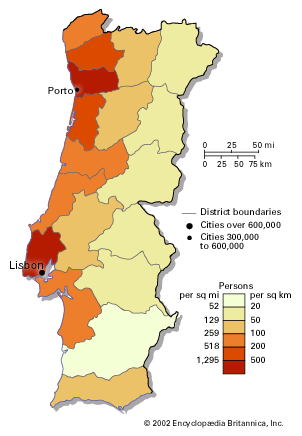

A Pearson Correlation tells us that the HoReCa channel is associated with fresh and frozen foods, while the Retail channel buys groceries, milk, and dry goods (detergents/paper).

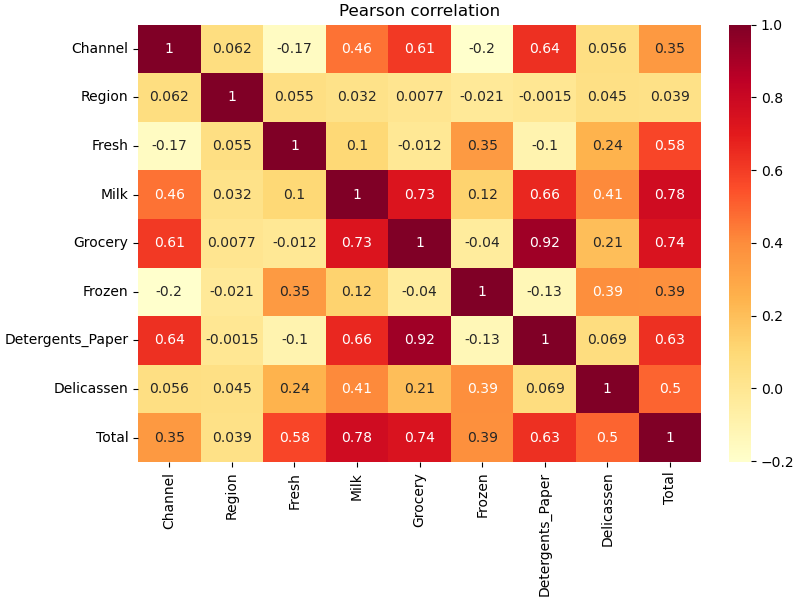

To better understand the breakdown of total spending across all categorical groups, I utilized a mosaic plot.

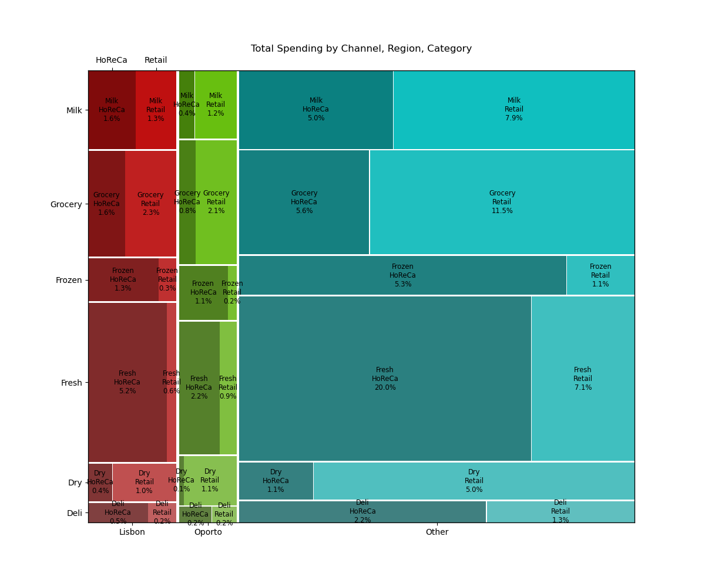

To help visualize the clusters, t-SNE was chosen for dimensionality reduction to preserve the shape of the relationships in 2D/3D space. This grid of plot shows the 2D t-SNE legended by each feature, which allows us to map out the space.

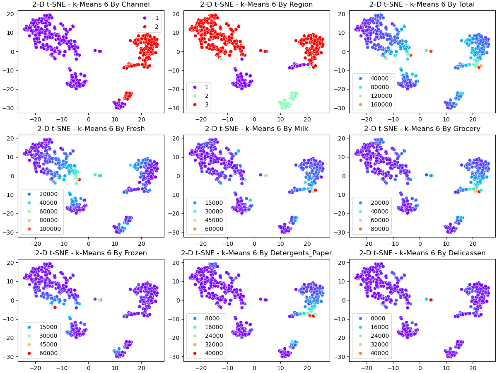

Taken together, we can manually label the islands by Channel and Region categories. With the total spending legend, we can see that low spending starts at the edge of the representation and high spending has two loci: one driven by HoReCa and Fresh/Frozen spending, the other driven by Retail and Grocery/Milk/Detergents_Paper (Dry) spending. Deli forms a mini-island.

Overall, we see four major island groups: HoReCa Other, Retail (Other + Lisbon), HoReCa Lisbon, Porto (HoReCa + Retail)

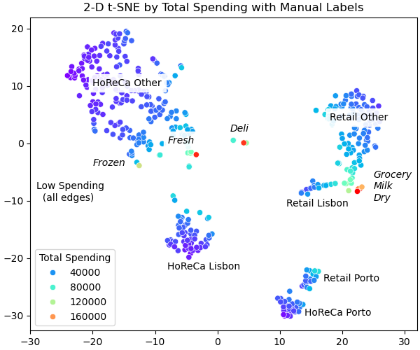

---

## Process

A key part of the analysis will be identifying the best customers to build business strategies around, so I summed the spending categories to product a Total Spending feature. The Channel and Region columns are dummy encoded within the modeling pipeline to avoid confusing the models with nominal data. Labels were updated for visualization as needed, otherwise no other modifications were needed.

Exploratory tests for k-Means suggested a model between 8-12 neighbors based on inertia and silhouette score trends. These models produced compact clusters with visualized with t-SNE in both 2-D and 3-D. However, outliers (the best customers) were frequently isolated into clusters of n < 5, which would not produce useful insights. Overall, silhouette scores were low in the 0.3-0.4 range. Choosing a k=6 was slightly left of the inertia elbow, and produced okay results, but testing continued.

DBSCAN was explored but was not expected to use clustering results aligned with the strategy since the model inherently filters outlier data. Hierarchical Clustering also failed to capture outliers within groups, so I returned to feature engineering and implemented winsorizing to pull in outlier points. For each spending column (total and each category), values were capped at the 95% percentile.

Focusing on k-Means, the process was repeated on the winsorized data.

---

## Model Results

### k-Means (before winsorizing)

The inertia plot falls between k 7-9. Silhouette scores peak at k=12, but scores are relatively low across all values.

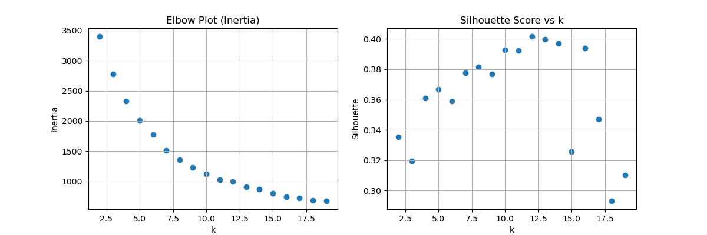

At k=6, the t-SNE representation shows that the 4 major clusters of data are isolated, but there are two additional "clusters" formed from aggregated outliers that represent just 14 customers with average spending > 130,000. This grouping does not align with the planned strategy. Using k=4, one of the clusters is again just outlier points, and it failed to differentiate one of true data clusters.

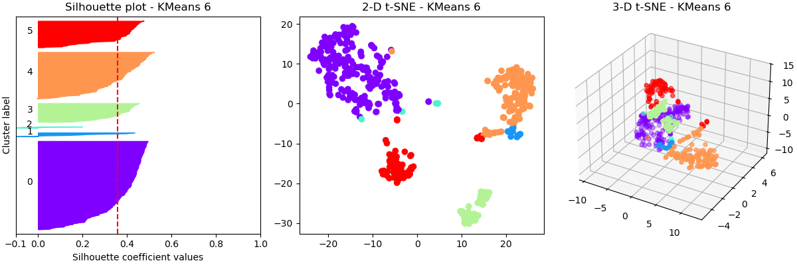

|  Cluster | Channel Mode  | Region Mode   |   N | Cluster Total Spending | Avg. Spending per Client | Cluster Fresh |   Avg. Fresh |   Cluster Grocery |   Avg. Grocery |   Cluster Milk |   Avg. Milk |
|-------------:|:----------------------|:---------------------|---------------------:|-------------------:|--------------------:|-------------------:|--------------------:|---------------------:|----------------------:|------------------:|-------------------:|
|            0 | HoReCa                | Other                |                  208 |          5,309,247 |              25,525 |          2,768,588 |              13,311 |              766,383 |                 3,685 |           640,318 |              3,078 |
|            4 | Retail                | Other                |                  110 |          4,433,629 |              40,306 |            921,949 |               8,381 |            1,556,774 |                14,152 |           971,274 |              8,830 |
|            5 | HoReCa                | Lisbon               |                   63 |          1,654,317 |              26,259 |            798,418 |              12,673 |              263,723 |                 4,186 |           247,516 |              3,929 |
|            3 | HoReCa                | Oporto               |                   45 |          1,303,920 |              28,976 |            423,439 |               9,410 |              352,350 |                 7,830 |           217,380 |              4,831 |
|            1 | Retail                | Other                |                   10 |          1,300,829 |             130,083 |            159,649 |              15,965 |              485,369 |                48,537 |           347,085 |             34,708 |
|            2 | HoReCa                | Other                |                    4 |            617,558 |             154,390 |            208,088 |              52,022 |               73,963 |                18,491 |           126,784 |             31,696 |

---

### DBSCAN

The k-distance plot shows an inflection point around 2, which is where we'd expect the most outlier inclusion right before the model collapses into a single cluster.

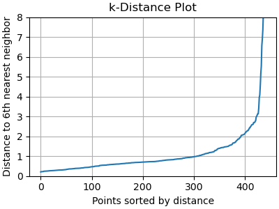

This is verified by modeling ε 2.0-2.5, but visual checks quickly show that outliers are still unclustered, even after the clusters collapse at ε=2.5, making DBSCAN ineffective for this exercise.

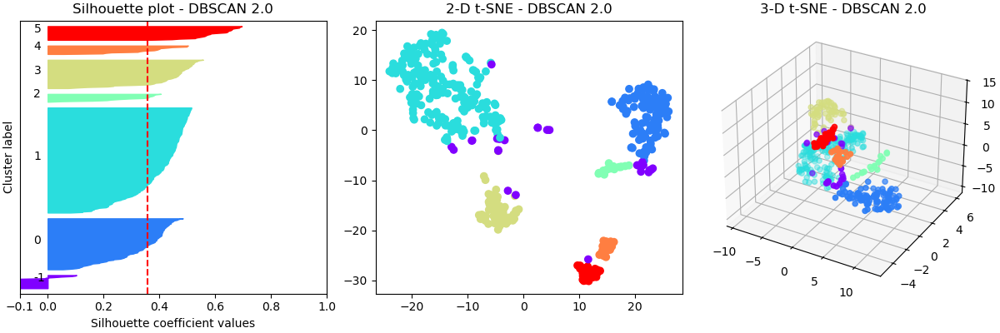

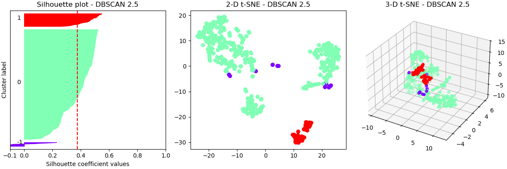

Outliers are captured in cluster -1. 27 clients with average spending of 104k.

|  Cluster | Channel Mode  | Region Mode   |   N | Cluster Total Spending | Avg. Spending per Client | Cluster Fresh |   Avg. Fresh |   Cluster Grocery |   Avg. Grocery |   Cluster Milk |   Avg. Milk |
|--------------:|:----------------------|:---------------------|---------------------:|-------------------:|--------------------:|-------------------:|--------------------:|---------------------:|----------------------:|------------------:|-------------------:|
|             1 | HoReCa                | Other                |                  201 |          4,773,079 |              23,747 |          2,502,684 |              12,451 |              697,698 |                 3,471 |           595,222 |              2,961 |
|             0 | Retail                | Other                |                   98 |          3,927,176 |              40,073 |            877,202 |               8,951 |            1,335,206 |                13,625 |           855,829 |              8,733 |
|            -1 | HoReCa                | Other                |                   26 |          2,724,531 |             104,790 |            797,449 |              30,671 |              651,943 |                25,075 |           556,395 |             21,400 |
|             3 | HoReCa                | Lisbon               |                   55 |          1,278,663 |              23,248 |            620,833 |              11,288 |              204,893 |                 3,725 |           183,806 |              3,342 |
|             4 | Retail                | Oporto               |                   17 |            679,776 |              39,987 |            113,118 |               6,654 |              240,159 |                14,127 |           168,717 |              9,925 |
|             2 | Retail                | Lisbon               |                   16 |            648,002 |              40,500 |             75,347 |               4,709 |              259,215 |                16,201 |           142,653 |              8,916 |
|             5 | HoReCa                | Oporto               |                   27 |            588,273 |              21,788 |            293,498 |              10,870 |              109,448 |                 4,054 |            47,735 |              1,768 |

---

### Hierarchical Clustering

Hierarchical Clustering was tested to find an effective t value, but numerous single-client clusters were split out by the model.

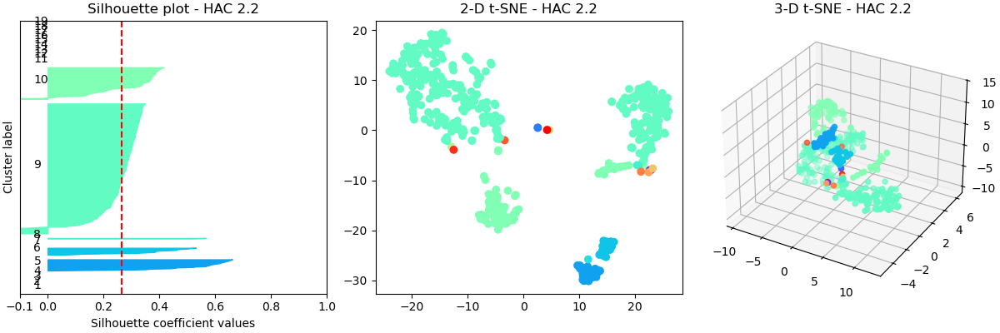

---

### k-Means (with winsorizing)

After winsorizing all spending columns at 95th percentile, the k-Means model exploration was repeated. The inertia plot no longer has an elbow feature but instead gradually transitions from k=5 to k=12. Silhouette score peaks at k=11, but all scores are generally low, similar to the non-winsorized data.

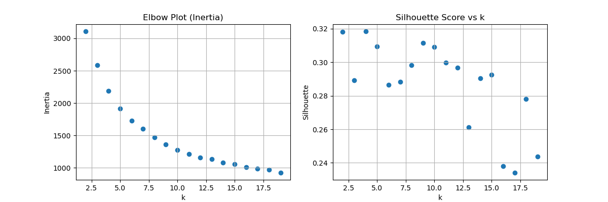

At k=6, all clusters are isolated and the model did not single out any outlier groups as fake clusters. All of the groups are well-sized with the smallest cluster having 38 members and the largest group being 153 members. Two of the clusters include negative silhouette coefficients (which is not ideal) but are creating splits on the larger islands and might indicate actual clusters in client behavior, so this looks promising! I will do a deeper dive into this result in the next section.

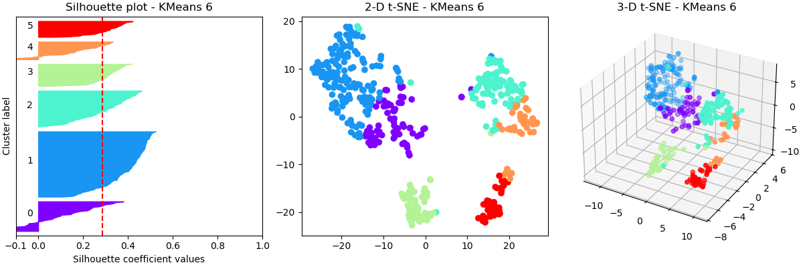

|  Cluster | Channel Mode  | Region Mode   |   N | Cluster Total Spending | Avg. Spending per Client | Cluster Fresh |   Avg. Fresh |   Cluster Grocery |   Avg. Grocery |   Cluster Milk |   Avg. Milk |
|-------------:|:----------------------|:---------------------|---------------------:|-------------------:|--------------------:|-------------------:|--------------------:|---------------------:|----------------------:|------------------:|-------------------:|
|            0 | HoReCa                | Other                |                   70 |          3,501,340 |              50,019 |          1,843,368 |              26,334 |              419,164 |                 5,988 |           397,282 |              5,675 |
|            2 | Retail                | Other                |                   85 |          2,958,139 |              34,802 |            675,506 |               7,947 |              992,618 |                11,678 |           636,838 |              7,492 |
|            1 | HoReCa                | Other                |                  153 |          2,639,862 |              17,254 |          1,224,027 |               8,000 |              477,847 |                 3,123 |           381,117 |              2,491 |
|            4 | Retail                | Other                |                   42 |          2,530,233 |              60,244 |            355,896 |               8,474 |              931,591 |                22,181 |           569,617 |             13,562 |
|            3 | HoReCa                | Lisbon               |                   52 |          1,040,624 |              20,012 |            494,312 |               9,506 |              168,893 |                 3,248 |           147,010 |              2,827 |
|            5 | HoReCa                | Oporto               |                   38 |            934,779 |              24,599 |            387,490 |              10,197 |              208,385 |                 5,484 |           119,393 |              3,142 |

---

## Cluster Analysis and Business Insights

Looking at the t-SNE visualization above with k-Means Clusters and the manual labels from earlier, we see that the winsorization has shifted the map somewhat, but that the 6 categorical islands remain mostly intact. The spending loci have shifted, with the deli mini-island disappearing and less definition between the fresh and frozen arms on HoReCa Other.

K-Means has assigned the clients into 6 groups, which I’m labeling:
- 0: HoReCa Super-Spenders
- 1: HoReCa Other Clients
- 2: Retail Clients
- 3: HoReCa Lisbon Clients
- 4: Retail Super-Spenders
- 5: Porto Clients

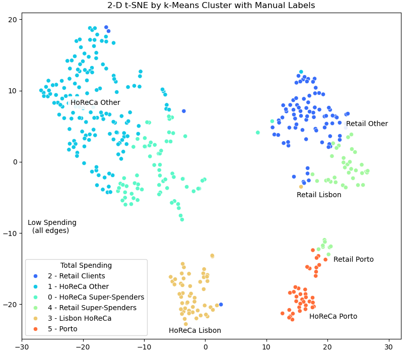

| Cluster Name          |   Cluster N |   Cluster Total |   Cluster Total Rank |   Avg Total |   Avg Total Rank |   Avg Fresh |   Avg Grocery |   Avg Milk |   Avg Frozen |   Avg Dry |   Avg Deli |
|:----------------------|------------:|----------------:|---------------------:|------------:|-----------------:|------------:|--------------:|-----------:|-------------:|----------:|-----------:|
| **HoReCa Super-Spenders** |      70 |   **3,501,340** |                **1** |      50,019 |                2 |  **26,334** |         5,988 |      5,675 |    **6,100** |       836 |  **2,137** |
| Retail Clients          |          85 |       2,958,139 |                    2 |      34,802 |                3 |       7,947 |        11,678 |      7,492 |        1,228 |     4,897 |      1,424 |
| HoReCa Other          |     **153** |       2,639,862 |                    3 |      17,254 |                6 |       8,000 |         3,123 |      2,491 |        2,033 |       672 |        882 |
| Retail Super-Spenders |          42 |       2,530,233 |                    4 |  **60,244** |            **1** |       8,474 |    **22,181** | **13,562** |   1,982 |**10,271** |      1,929 |
| Lisbon HoReCa         |          52 |       1,040,624 |                    5 |      20,012 |                5 |       9,506 |         3,248 |      2,827 |        2,594 |       974 |        863 |
| Porto                 |          38 |         934,779 |                    6 |      24,599 |                4 |      10,197 |         5,484 |      3,142 |        2,890 |     1,575 |      1,050 |

**Key cluster stats: number of clients, total and per client spending for each cluster, and category breakdown of average spending per client. Bold text indicates highest ranked cluster for each column.**

### Cluster 0: HoReCa Super-Spenders

HoReCa Super-Spenders is the top spending cluster with 3.5M total. Average spending per client is 50k, the 2nd highest among clusters. At 70 clients, this is 16% of the total dataset. All three regions are represented in this group, but Other is the majority class (reflective of the overall dataset).

This cluster is the top spender for Fresh and Frozen categories with nearly 3x all other clusters - both retail and HoReCa groups. It is also the top spender for deli (but only slightly ahead of Retail Super-Spenders), but this is a small category overall and not differentiated by any categorical. As a HoReCa group, Grocery, Milk, and Dry spending is below average. 

Business recommendations:
- Implement loyalty programs to drive retention, such as an end of year rebate, or volume discounts based on contract/subscription services.
- Implement premium service options, such as priority delivery or dedicated customer service.
- Provide delivery discounts for clients local to warehouses (presumably Lisbon and Porto). Consider adding additional warehouse locations given that only 27% of total business comes from Lisbon and Porto.
- Provide first access to limited premium product options within Fresh and Frozen such as organic, local, single-origin, etc that would allow HoReCa clients to differentiate themselves.
- Utilize cross-selling strategies (discounts, coupons) to encourage more spending in non-HoReCa categories (Milk/Grocery/Detergents/Paper) or in Deli (typically the smallest sales category)

|       |   Channel |   Region |   Total |   Fresh |   Milk |   Grocery |   Frozen |   Detergents_Paper |   Deli |
|:------|----------:|---------:|--------:|--------:|-------:|----------:|---------:|-------------------:|-------------:|
| count |        70 |       70 |      70 |      70 |     70 |        70 |       70 |                 70 |           70 |
| mean  |         1 |        3 |  50,019 |  26,334 |  5,675 |     5,988 |    6,100 |                836 |        2,137 |
| std   |         0 |        1 |  13,449 |   9,972 |  4,805 |     4,787 |    3,452 |                895 |        1,377 |
| min   |         1 |        1 |  28,483 |     759 |    286 |       471 |      127 |                 20 |            3 |
| 25%   |         1 |        3 |  37,446 |  18,873 |  2,616 |     2,484 |    2,999 |                282 |        1,092 |
| 50%   |         1 |        3 |  47,437 |  28,079 |  4,122 |     4,926 |    6,349 |                568 |        1,894 |
| 75%   |         1 |        3 |  58,226 |  36,818 |  6,901 |     7,321 |    9,930 |              1,079 |        2,910 |
| max   |         2 |        3 |  71,914 |  36,818 | 16,843 |    21,042 |    9,931 |              4,948 |        4,485 |

### Cluster 4: Retail Super-Spenders

Retail Super-Spenders is the 4th largest spending cluster with 2.5M total, but the top average spending per client at 60k. At 42 clients, this cluster is 10% of the dataset. All three regions are represented in this group, but Other is the majority class (reflective of the overall dataset).

This cluster is the top spender for Grocery, Milk, and Dry (Detergent/Paper) categories, spending 2x the Retail and many multiples of the HoReCa average.

Business recommendations:
- Implement loyalty programs to drive retention, such as an end of year rebate, or volume discounts based on contract/subscription services.
- Implement premium service options, such as priority delivery or dedicated customer service.
- Provide delivery discounts for clients local to warehouses (presumably Lisbon and Porto). Consider adding additional warehouse locations given that only 27% of total business comes from Lisbon and Porto.
- Survey clients to understand what additional products or categories are being requested by the client’s customers to grow new sectors and crowd out other suppliers.
- Utilize cross-selling strategies (discounts, coupons) to encourage more spending in non-Retail categories (Fresh/Frozen) or in Deli (typically the smallest sales category)

|       |   Channel |   Region |   Total |   Fresh |   Milk |   Grocery |   Frozen |   Detergents_Paper |   Deli  |
|:------|----------:|---------:|--------:|--------:|-------:|----------:|---------:|-------------------:|-------------:|
| count |        42 |       42 |      42 |      42 |     42 |        42 |       42 |                 42 |           42 |
| mean  |         2 |        2 |  60,244 |   8,474 | 13,562 |    22,181 |    1,982 |             10,271 |        1,929 |
| std   |         0 |        1 |  10,891 |   8,987 |  3,682 |     2,543 |    1,752 |              2,361 |        1,476 |
| min   |         2 |        1 |  42,183 |      85 |  3,737 |    13,567 |       36 |              4,337 |           37 |
| 25%   |         2 |        2 |  49,278 |   2,236 | 11,249 |    20,430 |      890 |              8,641 |          748 |
| 50%   |         2 |        3 |  62,945 |   5,540 | 14,520 |    24,016 |    1,460 |             12,043 |        1,498 |
| 75%   |         2 |        3 |  71,914 |  11,737 | 16,843 |    24,033 |    2,554 |             12,043 |        2,793 |
| max   |         2 |        3 |  71,914 |  36,818 | 16,843 |    24,033 |    7,782 |             12,043 |        4,485 |

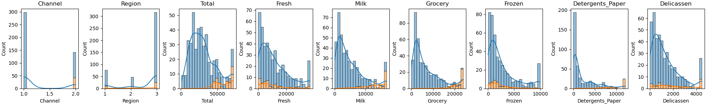

### Cluster 2: Retail Clients

Retail Clients is the 2nd largest spending cluster with 2.9M total, and 3rd highest spending per client at 35k. At 85 clients, it represents 19% of the dataset. This cluster represents the baseline spending group of retail clients in the Lisbon and Other regions.

As a retail group, it stands out for Grocery, Milk, and Dry (Detergents/Paper) categories, but at a lower level than the super-spender counterparts.

Business recommendations:
- Even as a baseline group, this is still the 3rd highest spending group. Target with mid-market strategies. Protect spending around economical products to cover basic business needs with discounts and volume contracts, while advertising the availability of premium options as well.
- Survey clients to understand what additional products or categories are being requested by the client’s customers to grow new sectors and crowd out other suppliers.
- Utilize cross-selling strategies (discounts, coupons) to encourage more spending in non-Retail categories (Fresh/Frozen) or in Deli (typically the smallest sales category)
- Advertise premium benefits available to Super-Spender group to try to encourage clients that are close to the threshold. 

|       |   Channel |   Region |   Total |   Fresh |   Milk |   Grocery |   Frozen |   Detergents_Paper |   Deli  |
|:------|----------:|---------:|--------:|--------:|-------:|----------:|---------:|-------------------:|-------------:|
| count |        85 |       85 |      85 |      85 |     85 |        85 |       85 |                 85 |           85 |
| mean  |         2 |        3 |  34,802 |   7,947 |  7,492 |    11,678 |    1,228 |              4,897 |        1,424 |
| std   |         0 |        1 |   9,078 |   7,395 |  2,855 |     3,971 |    1,131 |              2,011 |        1,089 |
| min   |         1 |        1 |  14,993 |      18 |  1,275 |     4,602 |       25 |                813 |            3 |
| 25%   |         2 |        3 |  28,084 |   1,725 |  5,921 |     9,170 |      287 |              3,516 |          436 |
| 50%   |         2 |        3 |  33,864 |   5,417 |  7,108 |    11,238 |      930 |              4,618 |        1,371 |
| 75%   |         2 |        3 |  38,694 |  12,126 |  9,465 |    13,916 |    1,691 |              6,707 |        1,894 |
| max   |         2 |        3 |  62,889 |  31,714 | 16,729 |    24,033 |    5,641 |              9,836 |        4,485 |

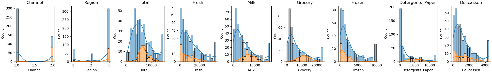

### HoReCa Clients (Cluster 1: HoReCa Other + Cluster 3: Lisbon HoReCa)

HoReCa Clients are presented together as the Other and Lisbon clusters behave similarly aside from their geography. Grouped together, they are 47% of the total dataset and would be the largest total spending group (3.7M). However, they have the lowest average client value at 18k (independently, their average client spending ranks 5th and 6th of 6). 

As HoReCa groups, they are low in the Grocery/Milk/Dry categories, but as baseline spenders, they don’t stand out in the Fresh/Frozen categories either.

Business recommendations:
- Being the cluster with the lowest average client spending, most clients are price sensitive and will seek out economical options and compromise on brands, features, and luxuries. 
- It is possible that the low spending group still contains some boutique businesses or other inconsistent spenders that operate high margins at low volumes. Survey clients to obtain additional feature datasets that could help break the cluster into smaller groups.
- Survey clients to understand if they have other business needs that are currently being met by other vendors and represent growth areas.
- Utilize cross-selling strategies (discounts, coupons) to encourage more spending in non-HoReCa categories (Milk/Grocery/Detergents/Paper) or in Deli (typically the smallest sales category)

**Cluster 1: HoReCa Other**

|       |   Channel |   Region |   Total |   Fresh |   Milk |   Grocery |   Frozen |   Detergents_Paper |   Deli  |
|:------|----------:|---------:|--------:|--------:|-------:|----------:|---------:|-------------------:|-------------:|
| count |       153 |      153 |     153 |     153 |    153 |       153 |      153 |                153 |          153 |
| mean  |         1 |        3 |  17,254 |   8,000 |  2,491 |     3,123 |    2,033 |                672 |          882 |
| std   |         0 |        0 |   7,393 |   6,248 |  1,986 |     2,504 |    2,052 |                852 |          875 |
| min   |         1 |        3 |     904 |       3 |     55 |         3 |       47 |                  3 |            3 |
| 25%   |         1 |        3 |  11,819 |   3,043 |  1,080 |     1,573 |      596 |                169 |          328 |
| 50%   |         1 |        3 |  16,850 |   6,338 |  1,891 |     2,431 |    1,336 |                319 |          610 |
| 75%   |         1 |        3 |  22,394 |  11,635 |  3,373 |     3,823 |    2,665 |                841 |        1,130 |
| max   |         2 |        3 |  36,953 |  26,539 |  9,250 |    16,483 |    9,931 |              4,595 |        4,485 |

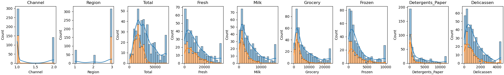

**Cluster 3: Lisbon HoReCa**

|       |   Channel |   Region |   Total |   Fresh |   Milk |   Grocery |   Frozen |   Detergents_Paper |   Deli  |
|:------|----------:|---------:|--------:|--------:|-------:|----------:|---------:|-------------------:|-------------:|
| count |        52 |       52 |      52 |      52 |     52 |        52 |       52 |                 52 |           52 |
| mean  |         1 |        1 |  20,012 |   9,506 |  2,827 |     3,248 |    2,594 |                974 |          863 |
| std   |         0 |        0 |   7,840 |   7,382 |  2,425 |     2,395 |    2,206 |              1,347 |          747 |
| min   |         1 |        1 |   4,925 |     514 |    258 |       489 |       91 |                  5 |            7 |
| 25%   |         1 |        1 |  13,746 |   3,286 |    984 |     1,547 |      947 |                203 |          294 |
| 50%   |         1 |        1 |  19,636 |   7,949 |  1,962 |     2,440 |    1,789 |                410 |          659 |
| 75%   |         1 |        1 |  25,409 |  13,866 |  4,063 |     4,835 |    3,808 |                927 |        1,172 |
| max   |         2 |        1 |  37,566 |  31,614 | 10,678 |    10,817 |    8,321 |              5,316 |        3,628 |

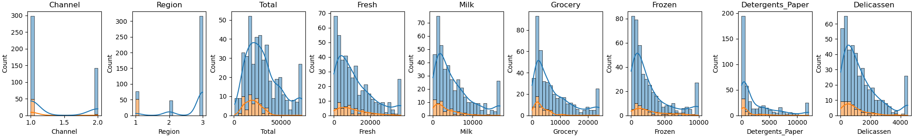

### Cluster 5: Porto Clients

Porto Clients, minus those peeled off by the Super-Spender clusters, represent the smallest cluster, with 0.9M in total spending. The 38 clients represent just 7% of the dataset. Average spending per client is 25k, ranking 4th among clusters. As a mixture of both HoReCa and Retail clients, spending is average across all categories.

Business recommendations:
- For clients near the warehouse location in Porto (on the assumption that there are two warehouses serving the entire nation), provide a self-pickup option in exchange for discounts. - Average spending per client is low for this cluster and clients are likely price sensitive and will seek out economical options and compromise on brands, features, and luxuries.
- It is possible that the low spending group still contains some boutique businesses or other inconsistent spenders that operate high margins at low volumes. Survey clients to obtain additional feature datasets that could help break the cluster into smaller groups.
- Survey clients to understand if they have other business needs that are currently being met by other vendors and represent growth areas.

|       |   Channel |   Region |   Total |   Fresh |   Milk |   Grocery |   Frozen |   Detergents_Paper | Deli  |
|:------|----------:|---------:|--------:|--------:|-------:|----------:|---------:|-------------------:|-------------:|
| count |        38 |       38 |      38 |      38 |     38 |        38 |       38 |                 38 |           38 |
| mean  |         1 |        2 |  24,599 |  10,197 |  3,142 |     5,484 |    2,890 |              1,575 |        1,050 |
| std   |         0 |        0 |  10,192 |   8,121 |  3,319 |     3,550 |    3,061 |              2,236 |          846 |
| min   |         1 |        2 |   4,129 |       3 |    333 |     1,330 |      264 |                 15 |           51 |
| 25%   |         1 |        2 |  18,127 |   3,164 |  1,315 |     2,501 |      805 |                235 |          536 |
| 50%   |         1 |        2 |  24,444 |   8,622 |  1,897 |     4,846 |    1,469 |                467 |          851 |
| 75%   |         2 |        2 |  31,663 |  16,306 |  3,494 |     7,490 |    3,552 |              2,076 |        1,204 |
| max   |         2 |        2 |  52,304 |  29,635 | 14,982 |    13,829 |    9,931 |             10,069 |        3,508 |

---

## Conclusions

A customer segmentation analysis was performed for a wholesale food and supply business in Portugal. The provided data consisted of client business type (Hotel/Restaurant/Cafe vs. Retail), region (Lisbon/Porto/Other), and annual spending across six categories: Fresh, Frozen, Grocery, Milk, Detergents/Paper (“Dry Goods”), and Delicatessen (Deli). After minimal processing (winsorization), a k-Means analysis was formed to identify 6 stable data clusters out of the 440 wholesale clients. Each cluster was characterized and business recommendations were offered.

Main results:

- There is potential for the expansion of additional locations to cover the 73% of business that comes from outside of Lisbon and Porto. A cost-benefit analysis to understand how this might reduce operational costs (delivery trucks/drivers/fuel), allow inventory expansions to attract more client business, attract more suppliers (fresh locally sourced crops for higher margin), etc.
- Average client spending analysis for each cluster informs how to offer targeted growth and retention opportunities through discounts, premium products and benefits, delivery options.
- Traditional purchase categories for each business channel offer opportunities for cross-selling and non-traditional growth.

Opportunities to expand analysis and business insights:
- More detailed invoice data might enable:
	- Time series analysis to understand cyclical ordering patterns and recency/frequency patterns to better target clients: churn potential,   targeted ads and offers, seasonality of business for inventory management (and also how this interacts with seasonality of food supplies) 
	- Specific cross-selling opportunities for new product classes, brands, etc.
- Survey data from client to understand growth opportunities into new products, to crowd out competing companies.
- More specific geographic data to make a more targeted recommendation on expanding new locations.
